# Prompts para IA - Proyecto PaymentOrder

## 1. Generación del contrato a partir del WSDL y el SD PaymentOrder

**Prompt:** 

**Imagen de la respuesta:** 
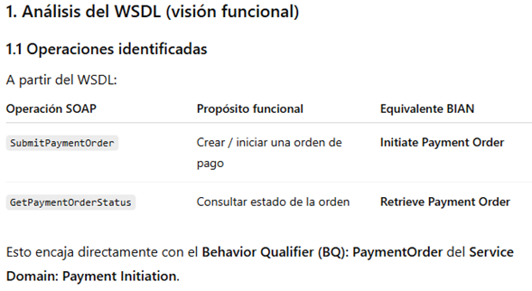

**Análisis de la respuesta:** 
En este caso se hicieron correcciones porque no me generó los esquemas con respecto al SD PaymentOrder. Se corrigió:

**Imagen de la nueva respuesta:** 

**Análisis de la respuesta:** 
Se corrigió para que se base en el request y response de los ejemplos.

**Nuevo prompt:** 
Corrige los esquemas según los ejemplos de Postman para asegurar consistencia total.

**Imagen de la nueva respuesta:** 
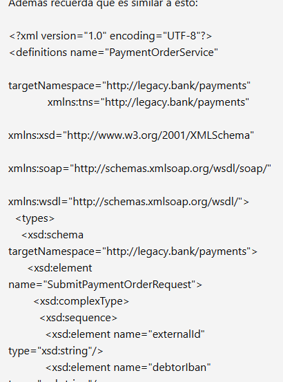

**Imagenes adicionales:** 
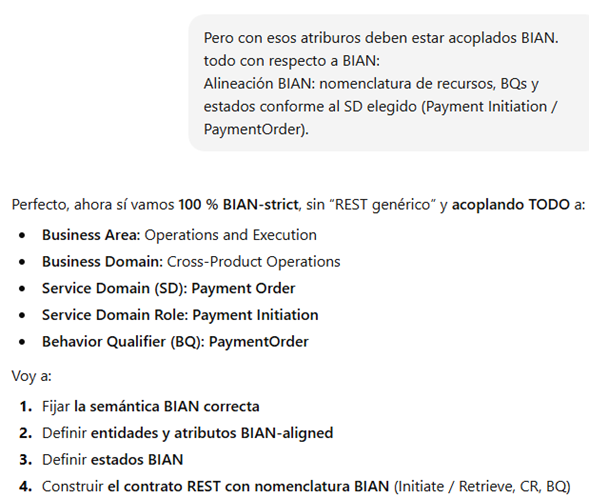
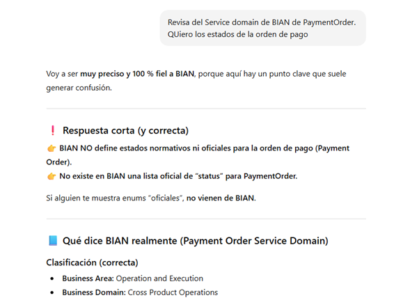

**Nuevo prompt:** 
Esto se logró comprobando la información oficial de BIAN.

---

## 2. Mapeo de datos para transformar entidades a DTOs y viceversa

**Prompt:** 
Genera mappers usando MapStruct para transformar entidades de PaymentOrder a DTOs y viceversa:
- Asegúrate de mapear todos los campos relevantes.
- Ignora campos que no deban persistir.
- Incluye lógica para transformar fechas y estados correctamente.
- Mantén la consistencia con el contrato OpenAPI generado.

**Análisis de la respuesta:** 
las fechas/estados no se transformaron como se esperaba.

**Nuevo prompt:** 
Realiza con MapStruct lo siguiente:
Mapstruct of localdatetime to OffsetDateTime

**Imagen de la nueva respuesta:** 
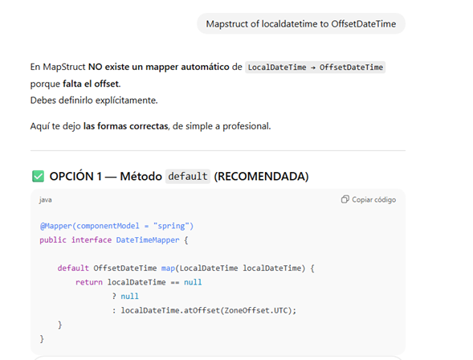

## 3. Actualización a Springboot 3.5.7

**Prompt:** 

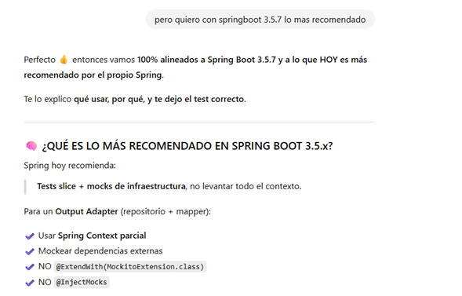

---

## 4. Implementación y ayuda con test unitarios

**Prompt:** 
Crea pruebas unitarias usando JUnit y Mockito para los servicios de PaymentOrder:
- Verifica la creación, y consulta de órdenes de pago.
- Valida que los mappers transformen correctamente entidades a DTOs y viceversa.
- Asegúrate de cubrir escenarios de éxito y error.
- Usa mocks para dependencias externas como base de datos y servicios externos.

**Imagen de la respuesta:** 
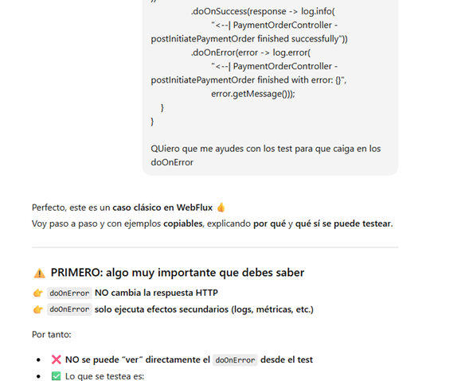

**Análisis de la respuesta:** 
Se solicitó corregir la forma en la que obtenía los datos del objeto. Es mejor comprobar el objeto y los valores de sus atributos:

**Nuevo prompt:** 
Se quiere en objetos y no en String las validaciones:
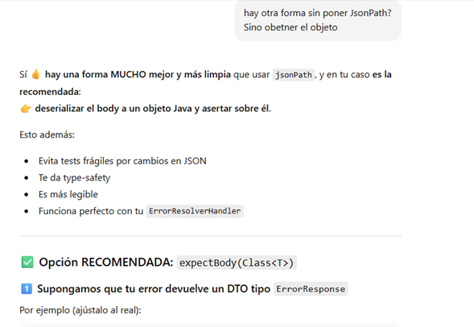
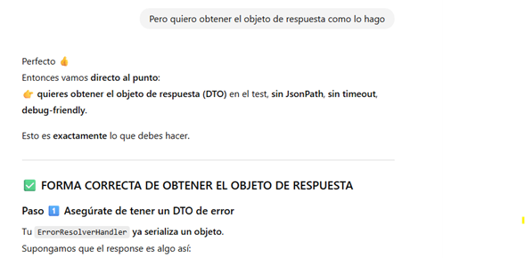

---

## 5. Scripts generados para la creación de tablas en PostgreSQL

**Prompt:** 
Genera scripts SQL para crear tablas en PostgreSQL basadas en las entidades de PaymentOrder:
- Incluye todos los campos con sus tipos correctos.
- Define llaves primarias y relaciones si aplica.
- Añade constraints básicas (NOT NULL, UNIQUE) según el modelo.
- Los scripts deben ser ejecutables en un contenedor Docker PostgreSQL.

**Imagen de la respuesta:** 
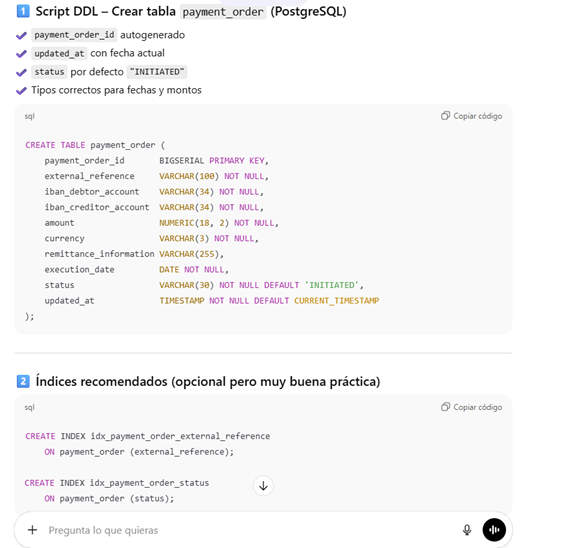

**Análisis de la respuesta:** 
Se pidió scripts para crear la tabla para la base de datos postgres. Para crear los scripts debe basarse en el Entity Generado.

**Nuevo prompt:** 
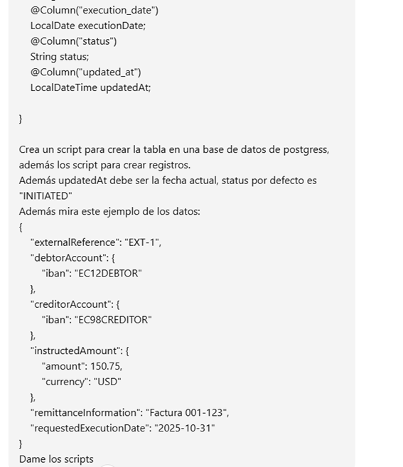

---

## 6. Ayuda en errores varios.

**Prompt:** 

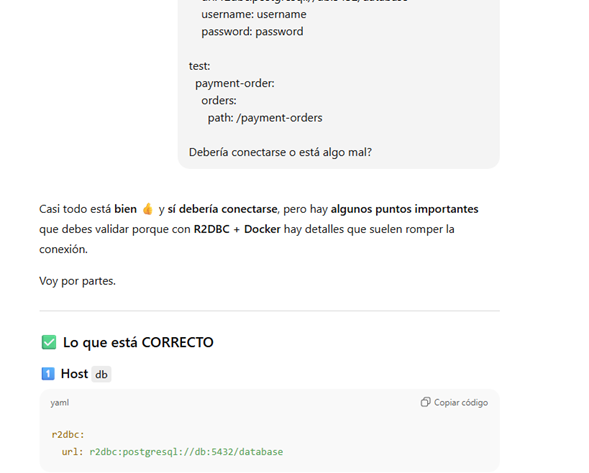
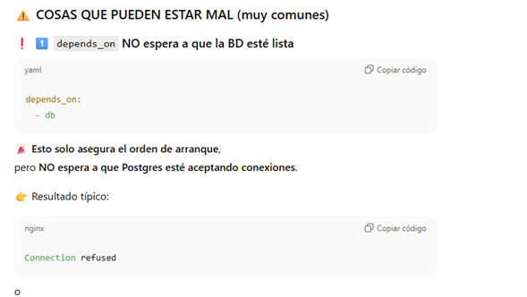

**Análisis de la respuesta:** 
No se solucionó el inconveniente, se le pasó el error.
**Nuevo prompt:** 
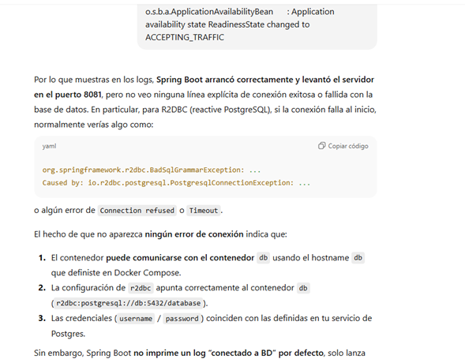

---

## 8. Resolución de Smell code y análisis con Snyk

**Prompt:** 
Te paso un issue detectado por SonarQube o Snyk. Dame:
1. Qué tipo de problema es.
2. Riesgos si no se corrige.
3. Solución concreta.
4. Código corregido listo para usar (antes y después).
Solo responde según el issue que te doy, sin analizar el proyecto completo.

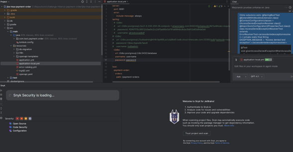

