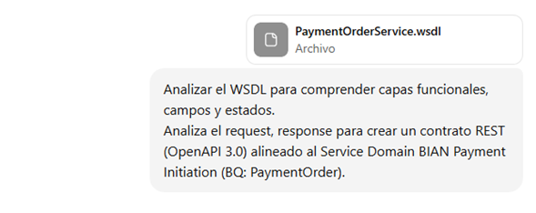

# Prompts para IA - Proyecto PaymentOrder

## 1. Generación del contrato a partir del WSDL y el SD PaymentOrder

**Prompt:** 
Genera un contrato OpenAPI para un servicio de PaymentOrder basado en el WSDL adjunto y el Service Domain PaymentOrder de BIAN.
- Asegúrate de mapear todos los request y response existentes.
- Incluye estados y flujos de pago comunes según BIAN.
- Genera esquemas correctos para cada DTO siguiendo buenas prácticas de OpenAPI.
- Evita duplicar campos y usa nombres claros y consistentes.

**Imagen de la respuesta:** 

**Análisis de la respuesta:** 
Aquí puedes describir qué parte de la respuesta no se generó correctamente y qué se pidió nuevamente a la IA.

**Nuevo prompt:** 
Corrige el contrato OpenAPI para que incluya todos los request/response y estados según BIAN.

**Imagen de la nueva respuesta:** 

---

## 2. Corrección de esquemas basados en request/response de Postman

**Prompt:** 
Corrige los esquemas del contrato OpenAPI generado anteriormente usando los ejemplos de request y response del archivo Postman Collection.
- Mantén consistencia con los tipos de datos esperados.
- Asegúrate que todos los campos requeridos estén presentes.
- Aplica validaciones básicas de tipos y formatos (string, date-time, integer, etc.).
- Revisa que coincidan con los endpoints reales del servicio.

**Imagen de la respuesta:** 

**Análisis de la respuesta:** 
Indica si hubo campos faltantes o errores en los tipos de datos y qué se pidió corregir.

**Nuevo prompt:** 
Corrige los esquemas según los ejemplos de Postman para asegurar consistencia total.

**Imagen de la nueva respuesta:** 

---

## 3. Definición de estados y flujos de pago según BIAN

**Prompt:** 
Agrega los estados y flujos de pago al contrato y a los DTOs siguiendo el Service Domain PaymentOrder de BIAN.
- Asocia cada estado con los posibles eventos o transiciones de flujo.
- Asegúrate que los estados sean consistentes en todos los endpoints y DTOs.

**Imagen de la respuesta:** 

**Análisis de la respuesta:** 
Indica si algún estado o transición de flujo no fue incluido correctamente.

**Nuevo prompt:** 
Asegúrate de agregar todos los estados y transiciones según el SD PaymentOrder.

**Imagen de la nueva respuesta:** 

---

## 4. Optimización de código y actualización de objetos en pruebas unitarias

**Prompt:** 
Revisa el código de los servicios y mappers generados para PaymentOrder y optimízalo:
- Actualiza el acceso a los atributos de los objetos según buenas prácticas.
- Reemplaza código obsoleto o repetitivo.
- Mejora la legibilidad de los mappers y servicios.
- Genera ejemplos de pruebas unitarias que validen correctamente los atributos y estados de los objetos.

**Imagen de la respuesta:** 

**Análisis de la respuesta:** 
Describe si la optimización no cubre todos los atributos o pruebas unitarias incompletas.

**Nuevo prompt:** 
Corrige los servicios y mappers para reflejar los cambios en pruebas unitarias.

**Imagen de la nueva respuesta:** 

## 5. Mapeo de datos para transformar entidades a DTOs y viceversa

**Prompt:** 
Genera mappers usando MapStruct para transformar entidades de PaymentOrder a DTOs y viceversa:
- Asegúrate de mapear todos los campos relevantes.
- Ignora campos que no deban persistir.
- Incluye lógica para transformar fechas y estados correctamente.
- Mantén la consistencia con el contrato OpenAPI generado.

**Imagen de la respuesta:** 

**Análisis de la respuesta:** 
Describe si algún campo no se mapeó correctamente o si las fechas/estados no se transformaron como se esperaba.

**Nuevo prompt:** 
Corrige los mappers para asegurar que todas las entidades y DTOs estén correctamente transformados.

**Imagen de la nueva respuesta:** 

---

## 6. Implementación y ayuda con test unitarios

**Prompt:** 
Crea pruebas unitarias usando JUnit y Mockito para los servicios de PaymentOrder:
- Verifica la creación, actualización y consulta de órdenes de pago.
- Valida que los mappers transformen correctamente entidades a DTOs y viceversa.
- Asegúrate de cubrir escenarios de éxito y error.
- Usa mocks para dependencias externas como base de datos y servicios externos.

**Imagen de la respuesta:** 

**Análisis de la respuesta:** 
Indica si alguna prueba no cubre los escenarios esperados o si los mocks no funcionan correctamente.

**Nuevo prompt:** 
Corrige las pruebas unitarias para cubrir todos los casos de éxito y error.

**Imagen de la nueva respuesta:** 

---

## 7. Scripts generados para la creación de tablas en PostgreSQL

**Prompt:** 
Genera scripts SQL para crear tablas en PostgreSQL basadas en las entidades de PaymentOrder:
- Incluye todos los campos con sus tipos correctos.
- Define llaves primarias y relaciones si aplica.
- Añade constraints básicas (NOT NULL, UNIQUE) según el modelo.
- Los scripts deben ser ejecutables en un contenedor Docker PostgreSQL.

**Imagen de la respuesta:** 

**Análisis de la respuesta:** 
Verifica si faltan campos, llaves primarias o constraints, y qué se pidió corregir.

**Nuevo prompt:** 
Corrige los scripts SQL para asegurar que todas las tablas y constraints estén correctamente definidas.

**Imagen de la nueva respuesta:** 

---

## 8. Resolución de Smell code y análisis con Snyk

**Prompt:** 
Te paso un issue detectado por SonarQube o Snyk. Dame:
1. Qué tipo de problema es.
2. Riesgos si no se corrige.
3. Solución concreta.
4. Código corregido listo para usar (antes y después).
Solo responde según el issue que te doy, sin analizar el proyecto completo.

**Imagen de la respuesta:** 

**Análisis de la respuesta:** 
Indica si la solución propuesta por la IA corrige totalmente el smell o vulnerabilidad.

**Nuevo prompt:** 
Solicita correcciones adicionales si la IA no resolvió por completo el issue.

**Imagen de la nueva respuesta:** 

---

## 9. Conexiones a la BD desplegada con Docker

**Prompt:** 
Tengo una conexión a PostgreSQL desplegada con Docker usando R2DBC en Spring Boot, pero da errores al conectar. 
- Explícame posibles causas del error.
- Sugiere soluciones concretas para que la conexión funcione.
- Indica ajustes en configuración, Docker o Spring Boot si aplica.
- No me des ejemplos genéricos, enfócate en resolver el problema real.

**Imagen de la respuesta:** 

**Análisis de la respuesta:** 
Describe la causa del error y si la solución propuesta por la IA funciona correctamente.

**Nuevo prompt:** 
Corrige la configuración y verifica la conexión a PostgreSQL en Docker.

**Imagen de la nueva respuesta:** 

